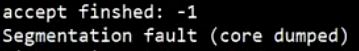
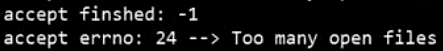

# 2-高性能网络设计

## 2.1 网络编程

### 2.1.1 网络IO与IO多路复用

#### 1. 一请求一线程

```c
#include <stdio.h>
#include <sys/socket.h>
#include <netinet/in.h>
#include <pthread.h>
#include <unistd.h>

void *client_thread(void *arg)
{
    int clinetfd = *(int *)arg;
    while (1)
    {
        char buffer[1024] = {0};
        int count = recv(clinetfd, buffer, 1024, 0);
        if (count == 0)
        {
            printf("client disconnect: %d\n", clinetfd);
            close(clinetfd);
            break;
        }
        printf("RECV: %s\n", buffer);
        send(clinetfd, buffer, count, 0);
        printf("SEND: %d\n", count);
    }
}

/*
	TCP Server流程
    1. 定义服务端sockfd、servaddr
    2. bind，绑定socket与servaddr
    3. listen，开始监听
    4. 定义客户端clientaddr
    5. accept拿到队首请求返回clientfd并将客户端信息传给clientaddr
    6. recv、send
*/
int main()
{
    int sockfd = socket(AF_INET, SOCK_STREAM, 0);

    struct sockaddr_in servaddr;
    servaddr.sin_family = AF_INET;
    servaddr.sin_addr.s_addr = htonl(INADDR_ANY);
    servaddr.sin_port = htons(2000);

    bind(sockfd, (struct sockaddr *)&servaddr, sizeof(struct sockaddr));

    listen(sockfd, 10);

    struct sockaddr_in clientaddr;
    socklen_t client_len = sizeof(clientaddr);

    while (1)
    {
        int clientfd = accept(sockfd, (struct sockaddr *)&clientaddr, &client_len);
        printf("accept: %d\n", clientfd);
        pthread_t pid;
        pthread_create(&pid, NULL, client_thread, &clientfd);
    }

    return 0;
}

```

优点：代码逻辑简单

缺点：不利于并发（创建线程很消耗资源 8M）


#### 2. select

fd_set的理解：

1. fd_set是一个比特位集合
2. 集合默认大小是1024
3. rfds用户空间，可以随意set、rset内核空间，用于判断和返回结果


fd相关函数：

1. FD_ZERO
2. FD_SET
3. FD_ISSET
4. FD_CLR


select的理解：

1. 每次调用需要把fd_set集合从用户空间copy到内核空间
2. 遍历到最大的maxfd，for (i = 0; i < maxfd; i++)检查每个fd是否可读可写出错


select(maxfd + 1, &rset, &wset, &eset, &tv);

- maxfd：最大sockfd+1，在fdset中sockfd值为下标，要想对下标为maxfd置一，就要遍历maxfd+1次
- rset：关注那些sockfd可读，如关注3 4 5 6，只有3 5可读的话，将可读set中下标3和5的地方置一
- tv（TIMESTAMP）是阻塞时间，如果是NULL是一直阻塞
- 返回值是在三个集合中置一的总数


FD_ISSET(sockfd, &rset)是返回sockfd是否在可读集合中置一


TCP网络IO有两类

- accept --> listen
- recv/send --> clientfd

```c
// select
#include <stdio.h>
#include <sys/socket.h>
#include <netinet/in.h>
#include <pthread.h>
#include <unistd.h>
#include <sys/select.h>

/*
    1. 定义fd_set集合、maxfd
    2. 循环调用select进行阻塞等待
    3. 对于TCP请求有两种处理方式：
        a. 对于listenfd ==> accept创建clientfd，并FD_SET
        b. 对于clientfd ==> for循环处理（recv，当count==0时close、FD_CLR，send）
*/
int main()
{
    int sockfd = socket(AF_INET, SOCK_STREAM, 0);

    struct sockaddr_in servaddr;
    servaddr.sin_family = AF_INET;
    servaddr.sin_addr.s_addr = htonl(INADDR_ANY);
    servaddr.sin_port = htons(2000);

    bind(sockfd, (struct sockaddr *)&servaddr, sizeof(struct sockaddr));

    listen(sockfd, 10);

    struct sockaddr_in clientaddr;
    socklen_t client_len = sizeof(clientaddr);

    // 创建fd_set
    fd_set rfds, rset;
    FD_ZERO(&rfds);
    FD_SET(sockfd, &rfds);
    int maxfd = sockfd;

    while (1)
    {
        rset = rfds;
        int nready = select(maxfd + 1, &rset, NULL, NULL, NULL);
        
        if (FD_ISSET(sockfd, &rset)) // 处理监听fd ==> accept
        {
            int clientfd = accept(sockfd, (struct sockaddr *)&clientaddr, &client_len);
            printf("accept: %d\n", clientfd);
            FD_SET(clientfd, &rfds);
            if (clientfd > maxfd) maxfd = clientfd;
        }
        // clientfd ==> recv/send
        for (int i = sockfd + 1; i <= maxfd; i++)
        {
            if (FD_ISSET(i, &rset))
            {
                char buffer[1024] = {0};
                int count = recv(i, buffer, 1024, 0);
                if (count == 0) 
                {
                    printf("client disconnect: %d\n", i);
                    close(i);
                    FD_CLR(i, &rfds);
                    continue;
                }
                printf("RECV: %s\n", buffer);
                count = send(i, buffer, count, 0);
                printf("SEND: %d\n", count);
            }
        }

    }

    return 0;
}
```

优点：实现了IO多路复用

缺点：参数太多


#### 3. poll

pollfd结构体的理解：

```c
struct pollfd {
	int fd; // 关注的fd
	short events; // 关注的事件（可读）
	short revents; // 返回是否真正可读（可写。。）
}
```

事件包括：POLLIN、POLLOUT、POLLPRI、POLLERR


poll(fds, maxfd + 1, -1);

-1代表一直阻塞

```c
// poll
#include <stdio.h>
#include <sys/socket.h>
#include <netinet/in.h>
#include <pthread.h>
#include <unistd.h>
#include <sys/select.h>
#include <poll.h>

/*
    流程与select方法相似，只是select采用FD_ISSET判断是否可读
    poll方法采用位运算的方式判断：fds[i].revents & POLLIN
*/
int main()
{
    int sockfd = socket(AF_INET, SOCK_STREAM, 0);

    struct sockaddr_in servaddr;
    servaddr.sin_family = AF_INET;
    servaddr.sin_addr.s_addr = htonl(INADDR_ANY);
    servaddr.sin_port = htons(2000);

    bind(sockfd, (struct sockaddr *)&servaddr, sizeof(struct sockaddr));

    listen(sockfd, 10);

    struct sockaddr_in clientaddr;
    socklen_t client_len = sizeof(clientaddr);

    // 定义pollfd数组，数组大小约等于监听的sockfd数
    struct pollfd fds[1024] = {0};
    fds[sockfd].fd = sockfd;
    fds[sockfd].events = POLLIN;
    int maxfd = sockfd;

    while (1) 
    {
        int nready = poll(fds, maxfd + 1, -1);

        if (fds[sockfd].revents & POLLIN) // 位运算判断sockfd是否可读
        {
            int clientfd = accept(sockfd, (struct sockaddr *)&clientaddr, &client_len);
            printf("accept: %d\n", clientfd);
            fds[clientfd].fd = clientfd;
            fds[clientfd].events = POLLIN;
            if (clientfd > maxfd) maxfd = clientfd;
        }
        
        for (int i = sockfd + 1; i <= maxfd; i++) // 对i个clientfd
        {
            if(fds[i].revents & POLLIN)
            {
                char buffer[1024] = {0};
                int count = recv(i, buffer, 1024, 0);
                if (count == 0)
                {
                    close(i);
                    printf("client disconnect: %d\n", i);
                    fds[i].fd = -1;
                    fds[i].events = 0;
                    continue;
                }
                printf("RECV: %s\n", buffer);
                count = send(i, buffer, count, 0);
                printf("SEND: %d\n", count);
            }
        }

    }
    return 0;
}
```


#### 4. epoll

epoll_event结构体的理解：

```c
struct epoll_event
{
  uint32_t events;	/* Epoll events */
  epoll_data_t data;	/* User data variable */
} __EPOLL_PACKED;
```


```c
epoll_create(int size) // 聘请快递员 组建快递柜。构建了总集（所有sockfd）、就绪（快递柜）、epfd
// 第三个参数可以为空（在DEL时）
epoll_ctl(int epfd, int op, int fd, struct epoll_event*)
// events是快递员每次带的袋子，maxevents是袋子容量
// timeout快递员多久去一次快递柜
epoll_wait(int epfd, struct epoll_event*, int maxevents, int timeout) 
```


epoll相比于poll和select不用遍历所有sockfd，效率高


相比select而言，对于大并发的优势在哪里？

- 如果有100w个IO，select会把100w个IObit都拷贝到内核，逐个检查其状态（是否可写）
- epoll创建后，IO是一个个的添加进去，在处理时只处理就绪就好了
- 一般情况下整集会有很多，但就绪的比较少（比如100w人在线，同一时间可能只有1w人在发送消息）


Questions：

1. 选择什么数据结构做整集？
    - **红黑树**快速查找fd，快速插入和删除 fd
2. 选择什么数据结构做就绪？
    - **双向链表**插入操作快速，扫描时按序遍历链表


```c
// epoll
#include <stdio.h>
#include <sys/socket.h>
#include <netinet/in.h>
#include <pthread.h>
#include <unistd.h>
#include <sys/select.h>
#include <poll.h>
#include <sys/epoll.h>

/*
    
*/
int main()
{
    int sockfd = socket(AF_INET, SOCK_STREAM, 0);

    struct sockaddr_in servaddr;
    servaddr.sin_family = AF_INET;
    servaddr.sin_addr.s_addr = htonl(INADDR_ANY);
    servaddr.sin_port = htons(2000);

    bind(sockfd, (struct sockaddr *)&servaddr, sizeof(struct sockaddr));

    listen(sockfd, 10);

    struct sockaddr_in clientaddr;
    socklen_t client_len = sizeof(clientaddr);

    // 创建epfd
    int epfd = epoll_create(1);
    
    struct epoll_event ev;
    ev.data.fd = sockfd;
    ev.events = EPOLLIN;
    
    epoll_ctl(epfd, EPOLL_CTL_ADD, sockfd, &ev); // sockfd是要监控的fd，ev是监听哪些事件
    
    while (1) 
    {
        struct epoll_event events[1024];
        int nready = epoll_wait(epfd, events, 1024, -1);

        for (int i = 0; i < nready; i++)
        {
            int connfd = events[i].data.fd;
            if (connfd == sockfd)
            {
                int clientfd = accept(sockfd, (struct sockaddr *)&clientaddr, &client_len);
                printf("accept: %d\n", clientfd);
                ev.data.fd = clientfd;
                ev.events = EPOLLIN;
                epoll_ctl(epfd, EPOLL_CTL_ADD, clientfd, &ev);
            }
            else if (events[i].events & EPOLLIN)
            {
                char buffer[1024] = {0};
                int count = recv(connfd, buffer, 1024, 0);
                if (count == 0) 
                {
                    close(connfd);
                    printf("client disconnect: %d\n", i);
                    epoll_ctl(epfd, EPOLL_CTL_DEL, connfd, NULL);
                    continue;
                }
                printf("RECV: %s\n", buffer);
                count = send(connfd, buffer, count, 0);
                printf("SEND: %d\n", count);
            }
        }
    }


    return 0;
}
```

一个IO的生命周期是由无数个事件组成

select/poll/epoll是对IO的管理，做到事件触发

比如一个IO有可读事件，就执行可读事件对应的回调函数；可写就执行对应的回调函数


### 2.1.2 reactor

由IO管理改为了事件管理


不同的io事件，做不同的action

io做到独立（封装）

```c
#include <stdio.h>
#include <sys/socket.h>
#include <netinet/in.h>
#include <pthread.h>
#include <unistd.h>
#include <sys/select.h>
#include <poll.h>
#include <sys/epoll.h>
#include <string.h>

#define BUFFER_LENGTH   1024
#define CONNECTION_SIZE 1024

typedef int (*RCALLBACK)(int fd);

int epfd = 0;

struct conn
{
    int fd;

    char r_buffer[BUFFER_LENGTH];
    int r_length;
    char w_buffer[BUFFER_LENGTH];
    int w_length;

    RCALLBACK send_callback;
    union // 定义联合，因为EPOLL_IN事件只会触发其中一个callback
    {
        RCALLBACK accept_callback;
        RCALLBACK recv_callback;
    } r_action;
};

struct conn conn_list[CONNECTION_SIZE] = {0}; // 结构体数组

int accept_cb(int fd);
int recv_cb(int fd);
int send_cb(int fd);

int init_server(unsigned short port)
{
    int sockfd = socket(AF_INET, SOCK_STREAM, 0);

    struct sockaddr_in servaddr;
    servaddr.sin_family = AF_INET;
    servaddr.sin_addr.s_addr = htonl(INADDR_ANY);
    servaddr.sin_port = htons(port);

    bind(sockfd, (struct sockaddr *)&servaddr, sizeof(struct sockaddr));

    listen(sockfd, 10);
    printf("listen finished: %d\n", sockfd);

    return sockfd;
}

int set_event(int fd, int event, int flag)
{
    if (flag) // 添加
    {
        struct epoll_event ev;
        ev.data.fd = fd;
        ev.events = event;
        epoll_ctl(epfd, EPOLL_CTL_ADD, fd, &ev);
    }
    else  // 修改
    {
        struct epoll_event ev;
        ev.data.fd = fd;
        ev.events = event;
        epoll_ctl(epfd, EPOLL_CTL_MOD, fd, &ev);
    }
    
}

// 注册fd事件对应的回调函数，在发生该事件后 直接调用回调函数即可
int event_register(int fd, int event)
{
    conn_list[fd].fd = fd;
    conn_list[fd].r_action.recv_callback = recv_cb;
    conn_list[fd].send_callback = send_cb;
    
    memset(conn_list[fd].r_buffer, 0, BUFFER_LENGTH);
    conn_list[fd].r_length = 0;
    memset(conn_list[fd].w_buffer, 0, BUFFER_LENGTH);
    conn_list[fd].w_length = 0;

    set_event(fd, event, 1);
}

int accept_cb(int fd)
{
    struct sockaddr_in clientaddr;
    socklen_t clientlen = sizeof(clientaddr);
    
    int clientfd = accept(fd, (struct sockaddr *)&clientaddr, &clientlen);
    printf("accept finished: %d\n", clientfd);

    // 设置clientfd
    event_register(clientfd, EPOLLIN);
    return 0;
}

int recv_cb(int fd)
{
    int count = recv(fd, conn_list[fd].r_buffer, BUFFER_LENGTH, 0);
    if (count == 0)
    {
        printf("client disconnect: %d\n", fd);
        close(fd);
        epoll_ctl(epfd, EPOLL_CTL_DEL, fd, NULL);
        return 0;
    }
    conn_list[fd].r_length = count;
    printf("RECV: %s\n", conn_list[fd].r_buffer);

    conn_list[fd].w_length = conn_list[fd].r_length;
    memcpy(conn_list[fd].w_buffer, conn_list[fd].r_buffer, conn_list[fd].w_length);
    set_event(fd, EPOLLOUT, 0);
    return count;
}

int send_cb(int fd)
{
    int count = send(fd, conn_list[fd].w_buffer, conn_list[fd].w_length, 0);
    printf("SEND: %d\n", count);
    set_event(fd, EPOLLIN, 0);
    return count;
}

int main()
{
    unsigned short port = 2000;
    int sockfd = init_server(port);

    epfd = epoll_create(1);
    conn_list[sockfd].fd = sockfd;
    conn_list[sockfd].r_action.accept_callback = accept_cb;
    set_event(sockfd, EPOLLIN, 1);

    while (1)
    {
        struct epoll_event events[1024] = {0};
        int nready = epoll_wait(epfd, events, 1024, -1);

        for (int i = 0; i < nready; i++)
        {
            int connfd = events[i].data.fd;

            if (events[i].events & EPOLLIN)
            {
                conn_list[connfd].r_action.recv_callback(connfd);
            }
            if (events[i].events & EPOLLOUT)
            {
                conn_list[connfd].send_callback(connfd);
            }
        }
    }

    return 0;
}
```


#### 百万并发服务器

查看端口情况：`netstat -anop | grep 2000`

问题1：当sockfd大于1024的时候


问题2：core dump，因为accept返回值为-1 没有进行判断



问题3：服务端too many



问题4：五元组不够


fd→TCP连接`(sip, dip, sport, dport, proto)`

本地远程IP都确定了，客户端端口1024-65535，而服务器端口只有1个，改为20

问题5：客户端到65000上不去了


`vim /etc/sysctl.conf`

`fs.file-max=1048576
net.nf_conntrack_max=1048576`

问题6：内存不足

`net.ipv4.tcp_mem = 252144 524288 786432
net.ipv4.tcp_wmem = 1024 1024 2048
net.ipv4.tcp_rmem = 1024 1024 2048`


### 2.1.3 HTTP服务器实现

epoll水平触发和边缘触发：

- 水平触发：有数据就会一直触发，适合大小比较固定
- 边缘触发：只会触发一次，不管读没读完（配合while循环），适合大小不确定的IO


## 2.2 网络原理

### 2.2.2 Posix API与网络协议栈

客户端api：

1. socket()
2. bind() // 绑定就是在指定端口，否则就是随机端口
3. connect()
4. send()
5. recv()
6. close()

服务器api：

1. socket()
2. bind()
3. listen()
4. accept()
5. recv()
6. send()
7. close()

epoll：

1. epoll_create(); 
2. epoll_ctl(); 
3. epoll_wait(); 

fcntl();


**第一阶段：建立连接**


分成两部分开三次握手，第一个seqnum代表客户端要从哪发送，acknum是seqnum+1，代表服务器同意；第二个seqnum代表服务器要从哪发送，acknum是seqnum+1，代表客户端同意。

<u>*三次握手发生在哪些函数里？*</u>

connec(); listen(); accept();

`listen(fd, backlog)`第二个参数的三个阶段：

1. syn队列（防止syn泛洪）
2. syn + accept队列总长度（未分配fd的tcb数量）（防止accept处的请求长时间等待，这个是直接创建）
3. accept队列长度（快速创建）

`accept()`

1. 分配fd
2. fd --> tcb

accept一般是用水平触发，如果使用边缘触发，那要通过循环创建出clientfd


**第二阶段：数据传输**


`recv()  send()`

recv和send都是与内核进行数据操作，把数据从内核拷贝或把数据发送到内核。


TCP/IP中的几个概念：慢启动、拥塞控制、滑动窗口、延迟确认、超时重传


**第三阶段：断开连接**


`close()`

1. 回收fd
2. 发空包，fin置一

<u>*如何检测到对方发了空包（fin置一）？*</u>

recv的返回值为0


<u>*没有收到ack，先收到fin*</u>

先从FIN_WAIT_1到CLOSING状态，再TIME_WAIT（正常是FIN_WAIT_1-->FIN_WAIT_2）

*<u>双方同时调用close</u>*

双方都是从FIN_WAIT_1到CLOSING状态，再TIME_WAIT


作业：TCP点对点p2p（互为客户端服务器）（上面三次握手图中的横线）不经过服务器，点对点通信


### 2.2.3 UDP的可靠传输协议QUIC

UDP如何做到可靠性传输


UDP与TCP，如何选择


UDP如何可靠，KCP协议在哪些方面有优势


KCP协议精讲


QUIC？


